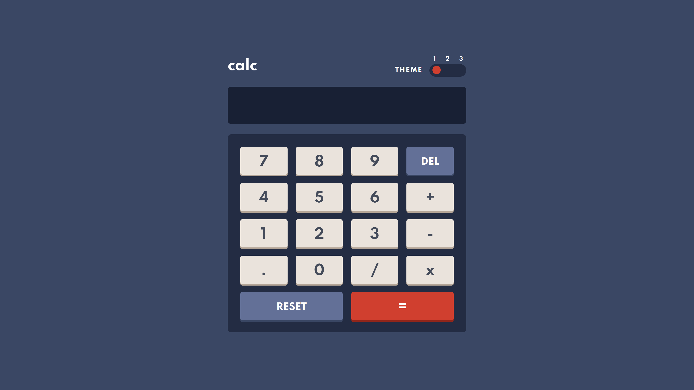

# Frontend Mentor - Calculator app solution

This is a solution to the [Calculator app challenge on Frontend Mentor](https://www.frontendmentor.io/challenges/calculator-app-9lteq5N29). Frontend Mentor challenges help you improve your coding skills by building realistic projects. 

## Links

- [GitHub](https://github.com/avsecam/FM-Calculator)
- [Live Site](https://avsecam.github.io/FM-Calculator/)

## Built with

- HTML
- CSS with SCSS
- JS

## Author

- Frontend Mentor - [@avsecam](https://www.frontendmentor.io/profile/avsecam)
